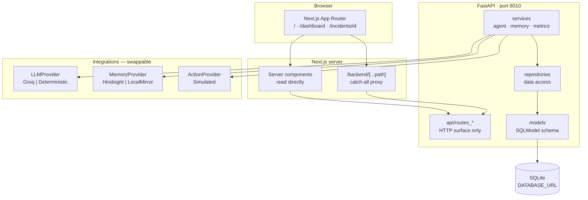
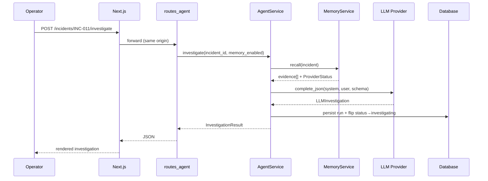
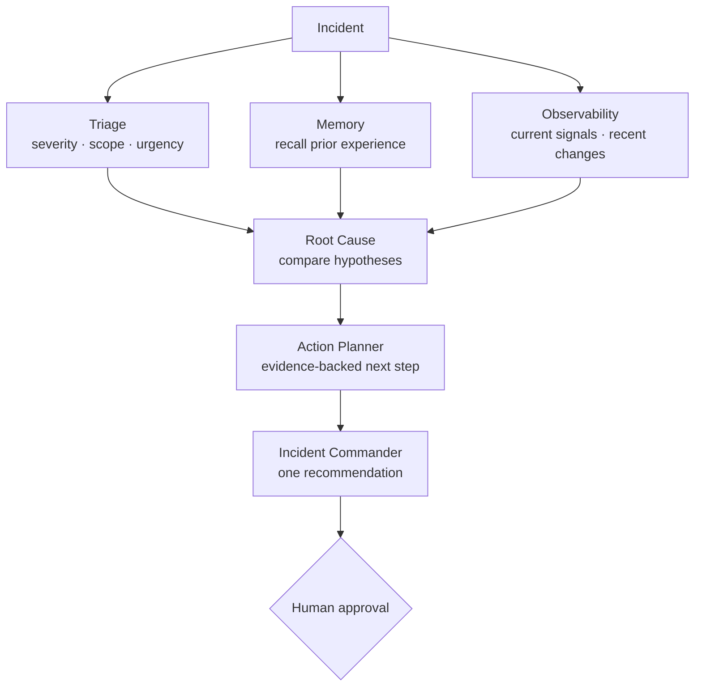
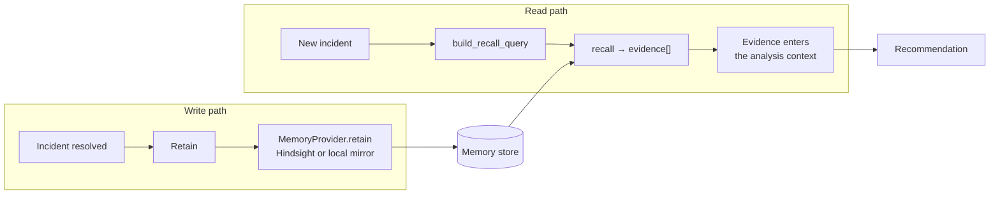
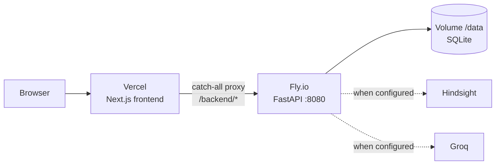

# IncidentMind — Architecture

Reference for the system as built. Where the implementation is narrower than a
judge might assume, it says so.

---

## 1 · System shape

**The layering rule.** `api/` holds HTTP concerns and no business logic.
`services/` owns orchestration and business rules. `repositories/` own SQL and
return SQLModel instances. `integrations/` is the only place vendor-specific
code exists. The consequence that matters: a dead external service degrades a
response, it does not produce a 500.

---

## 2 · Frontend

Next.js App Router, TypeScript, Tailwind, shadcn/ui.

| Route | Rendering | Purpose |
|---|---|---|
| `/` | `○` static | Product narrative. Fully static — renders even with the API down. |
| `/dashboard` | `ƒ` dynamic | Command center: KPIs, memory effect, recent learning, incident table. |
| `/history` | `ƒ` dynamic | Retained organisational memory. |
| `/incidents/[id]` | `ƒ` dynamic | Investigation workspace — the core product surface. |
| `/backend/[...path]` | `ƒ` dynamic | Catch-all proxy to the FastAPI API. |
| `/robots.txt` | `○` static | Private-console declaration. |

### The API layer is frozen and centralised

Three modules, one job each, no raw `fetch()` anywhere in the app:

- `lib/api-core.ts` — `buildApi(base)`, the typed client factory. All request
  shapes and method signatures live here.
- `lib/api-server.ts` — server components bind directly to `API_INTERNAL_URL`.
  Marked `server-only`, so the internal host never reaches the client bundle.
- `lib/api-client.ts` — browser calls go to `buildApi("/backend")`, i.e. the
  same origin, which removes CORS preflight from the happy path.

This is why deploying the frontend does not leak infrastructure: the browser
only ever talks to one origin, and the backend address is a server-side value.

### Honest degradation

The landing page probes `/api/health` client-side. When the API is unreachable
it says *"API unavailable · static product preview remains available"* and keeps
the narrative. The dashboard renders `ErrorState` explaining that every panel
depends on the API, and names the configured address so an operator knows which
port to start. Neither state pretends to be healthy.

---

## 3 · Backend

FastAPI, layered as above. Configuration is a single `Settings` object
(`app/config.py`) — the only module that reads the environment.

### Request flow for an investigation

**The investigation is sequential.** `AgentService.investigate` performs exactly
one recall and one analysis call, in that order, then persists. There is no
`asyncio.gather`, no thread pool, and no per-specialist model call.

The specialist roles shown in the interface — Triage, Memory, Observability,
Root Cause, Action Planner, Incident Commander — are an ordered narration
produced by `_investigation_steps`, which describes what the single analysis
pass did. They are a model of the reasoning, not separately executing processes.

This is stated plainly because the interface renders them as a concurrent
network, and a judge reading the animation could reasonably assume otherwise.

---

## 4 · Agents

The conceptual pipeline, which is the design the UI communicates:

Triage, Memory and Observability are independent by design and would be the
concurrency boundary. The benefit is not latency — it is **failure isolation**:
a memory agent returning nothing should degrade the investigation and say so,
not fail it, and a slow stage should not block the others. The current
sequential pipeline does not yet deliver that isolation, and does return
per-provider `mode`, `available`, `detail` and `latency_ms`, which is the
observability needed to prove it later.

### Safety properties

- `requires_human_approval=True` on every investigation, unconditionally.
- `SimulatedActionProvider` has no execution path. Its health detail literally
  reads `simulated action layer; no real execution path exists`.
- Simulation is outcome-sensitive: approving the recommended remedy recovers
  well, approving an unrelated one recovers poorly. The demo rewards being right
  rather than being clicked.
- The system prompt forbids claiming execution, inventing metrics, and inventing
  historical facts.

---

## 5 · Memory

**What is stored.** For each retained incident: incident identity and service,
concluded root cause, action taken and its type, outcome, the lesson, and
supporting signal values. Structured conclusions, not raw logs — logs stay in
the log store.

**Three states, deliberately distinguished.** The system never collapses these,
because collapsing them makes a broken integration look like a healthy system
with nothing to report:

| State | Reported as |
|---|---|
| Memory withheld for the control run | `Organisational memory was disabled` |
| Searched, nothing relevant | `No relevant historical experience found` |
| Provider failed | `Memory unavailable`, status `degraded` |

**The control condition is real.** `investigate(..., memory_enabled=False)` runs
the same incident, same signals and same analysis pipeline with memory withheld.
It is not handicapped in any other way, which is what makes the memory ON/OFF
comparison meaningful. The flag also travels into the prompt context so the
model can distinguish "withheld" from "searched and empty".

---

## 6 · Providers and degradation

Every external dependency sits behind an interface, resolved by a factory.

| Interface | Live | Fallback | Selected by |
|---|---|---|---|
| `LLMProvider` | Groq | `DeterministicLLMProvider` | `LLM_PROVIDER=auto` |
| `MemoryProvider` | Hindsight | `LocalMemoryProvider` (SQLite mirror) | `MEMORY_PROVIDER=auto` |
| `ActionProvider` | — | `SimulatedActionProvider` (only) | fixed |

`auto` means: use the live provider when configured, otherwise the fallback.
Every response carries `ProviderStatus` — `name`, `mode`, `available`, `detail`,
`latency_ms` — and `GET /api/health` reports the same. With no credentials the
system runs end to end and labels itself `mode=demo` rather than pretending.

The LLM path degrades in two stages: primary provider failure falls back to the
secondary, and if every provider fails the service returns a valid,
explicitly-unavailable result naming the reason. It never fabricates a
recommendation to fill a gap.

---

## 7 · Persistence

SQLModel over SQLite via `DATABASE_URL`. Entities: `Incident`,
`Investigation` (the auditable run), `MemoryEvent` (retained experience).

Every investigation persists its full run — mode, summary, hypotheses,
recommendation, risk, memory evidence, provider modes, duration, request id — so
any claim in the UI can be traced to a stored record.

There is no migration framework. `create_all()` runs in the FastAPI lifespan, so
a fresh checkout runs immediately, and an empty database is seeded with the
reference corpus outside production so a cold start has real history to recall.

---

## 8 · Memory lifecycle, end to end

1. **Detect** — an incident record exists with signals, metrics, deployment
   context.
2. **Investigate** — recall historical experience, then analyse current signals
   together with anything recalled.
3. **Decide** — a ranked hypothesis set, a recommendation, a risk level.
4. **Approve** — a human approves. Mandatory.
5. **Simulate** — deterministic telemetry converges toward a healthy baseline,
   better when the approved action matches the recommendation.
6. **Resolve** — outcome recorded against the incident.
7. **Retain** — root cause, action, outcome and lesson written to memory.
8. **Recur** — a similar incident arrives; recall returns the retained
   experience; it enters the evidence set before analysis.

Step 8 is the one to demonstrate. It is the difference between an AI assistant
and a system that compounds.

---

## 9 · Deployment

The frontend cannot run the API. It is a stateful FastAPI application with
SQLite, a startup lifespan that seeds data, and request-scoped orchestration —
none of which fits a stateless ephemeral function. The backend therefore needs an
always-on Python host, and `API_INTERNAL_URL` points at it.

Provided for this: `backend/Dockerfile`, `backend/.dockerignore`,
`backend/fly.toml`. None of them modify application code. `PORT` is already read
from the environment, so the platform's assigned port is honoured with no code
change. Secrets belong in `fly secrets`, never in `fly.toml`.

---

## 10 · Demo mode

Deterministic and repeatable, for a pitch that has to work on demand.

- `DeterministicLLMProvider` classifies an incident against known patterns and
  returns structured analysis without a model call.
- `/api/demo/run` drives a scripted incident lifecycle; `/api/demo/reset` returns
  to the seeded baseline; `/api/demo/scenarios` lists what is available.
- Reset → run → reset → run is the expected cycle, and does not depend on
  browser state.

The purpose of demo mode is honesty rather than convenience: it is a label on a
fully functional offline path, so a reviewer is never misled about which
providers actually answered.
