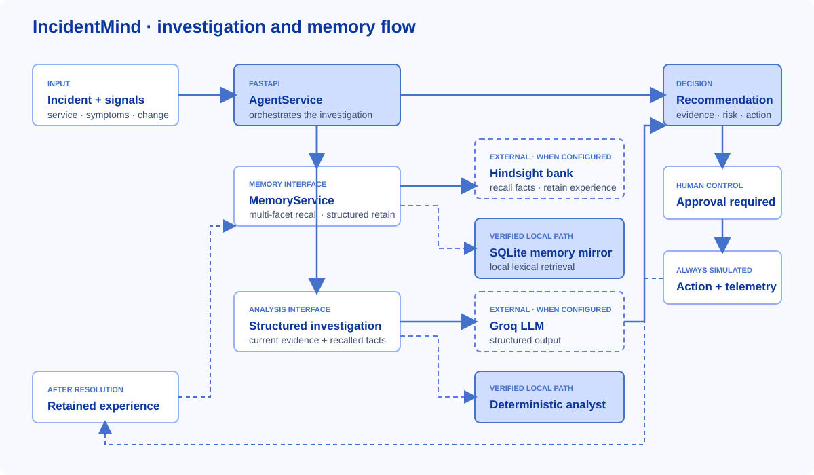

# How I Designed an Incident Agent Around Hindsight Memory

The dangerous moment in incident response is not always the first alert. It is the next incident that looks familiar enough to trigger a fast answer, but different enough that nobody can explain why that answer is safe.

I built IncidentMind around a small rule: memory should change an investigation only when the system can show what it recalled, why it was relevant, and what action followed from it. That rule shaped the Hindsight integration, the API response, the UI, and even the way I test the workflow.

## The loop is more than recall

IncidentMind is an incident-response command center built with FastAPI, SQLite, and a Next.js interface. An operator opens an incident, reviews its current signals, and asks the agent to investigate. The investigation can retrieve prior experience, combine it with current evidence, and return a structured recommendation. An operator must approve an action, and the action provider is simulated. When the incident is resolved, the system can retain a structured record of what happened.

That last step is the important one. If the system only retrieves memories, it is a search box beside an incident. If it only retains, it is an archive. The useful behavior is the cycle: resolve one failure, record the evidence and outcome, then make that experience available to a later investigation.



I chose Hindsight as the external memory boundary because incident experience is more useful as retrievable context than as a parameter update. The system does not fine-tune a model. It stores structured experience and retrieves relevant facts when an incident arrives. The [Hindsight memory repository](https://github.com/vectorize-io/hindsight), [Hindsight documentation](https://hindsight.vectorize.io/), and Vectorize's explanation of [agent memory](https://vectorize.io/what-is-agent-memory) describe the provider layer this design targets.

## The query is an operational description

A title such as “checkout is broken” is not enough to find a useful precedent. The memory service builds a query from the incident's service, title, symptoms, signals, metrics, deployment, severity, and a locally derived failure pattern. It asks for resolved incidents with a similar shape and requests the cause, successful action, and outcome.

That query construction is explicit in `backend/app/services/memory_service.py`:

```python
lines.append(f"SERVICE: {service}")
if incident.signals:
    lines.append("SIGNALS: " + "; ".join(str(s) for s in incident.signals))

profile = QueryProfile.from_incident(_incident_to_dict(incident))
if profile.pattern_tokens:
    lines.append("FAILURE PATTERN: " + ", ".join(sorted(profile.pattern_tokens)))
```

The facets matter because incident language is inconsistent. One report says “database connection pool exhausted”; another says “workers waiting for every datastore slot.” They may describe the same operational failure without sharing a title or the same percentage. A useful retrieval query has to preserve the operational dimensions that connect them.

When Hindsight is configured, `HindsightMemoryProvider` calls its bank's `/memories/recall` endpoint with the query, selected fact types, and configured recall budget. The adapter maps returned facts into the application's evidence shape. Provider selection lives in one factory, so the orchestration asks for a memory provider rather than branching throughout the agent code on a vendor name.

## Empty, withheld, and unavailable are different

One design decision changed how I think about memory-enabled agents: “no memories” is not a complete system state.

There are at least three different cases. First, an operator can deliberately run a memory-off control. Second, the memory provider can respond successfully but return no relevant experience. Third, a provider can be missing or fail, in which case the system may use its configured fallback or report that it could not retrieve external memory. Those states imply different things, so I do not want them collapsed into one empty array and a confident-sounding summary.

`AgentService.investigate` keeps the control path explicit:

```python
if memory_enabled:
    memory_service = MemoryService(self.session, self.settings)
    recall_response, evidence, memory_provider_status = memory_service.recall(
        incident, extra_context=extra_context
    )
else:
    memory_detail = (
        "Organisational memory was disabled for this run (memory OFF control path)."
    )
```

Both paths use the same incident signals and the same analysis pipeline. The only controlled difference is whether historical evidence is supplied. That makes “with memory” versus “without memory” a meaningful comparison rather than a weaker baseline engineered to lose.

The distinction also reaches the UI. It can show a provider mode, a recall status, the source of the evidence, and a rationale for why a record matched. This makes the fallback visible instead of quietly presenting a local result as though it came from Hindsight.

## A score needs a source

Hindsight's recall response does not provide a similarity score. I decided not to invent one or attach a locally calculated score to the Hindsight provider. The adapter leaves the provider score unset; the application can then calculate a local lexical relevance value and label its method accordingly.

```python
RetrievedMemory(
    id=str(item.get("id") or f"hindsight-{index}"),
    text=str(item.get("text") or ""),
    context=item.get("context"),
    score=None,
    provider=self.name,
    raw=item,
)
```

The distinction is small in code and large in meaning. A number beside a memory can look authoritative even when the provider never returned it. IncidentMind keeps the evidence, the explanation, and the score's origin together. For a local match, the method is identified as local lexical overlap; it is never described as a Hindsight similarity score.

## What the repeatable example proves

The repository includes a learning-loop scenario with two checkout incidents. The first describes a post-deployment failure with a saturated database pool. The second uses different wording: customers report hanging checkouts and workers waiting for database slots. The first incident is investigated, its simulated action is explicitly approved, and its resolution is retained. The second incident is then run once with memory withheld and once with memory enabled.

I ran `python scripts/verify_learning_loop.py`. All 33 checks passed. In that run, the memory-off recommendation was a generic rollback of the current checkout release at confidence `0.35`. The memory-on run recalled the earlier incident and recommended rolling back to the previously known-good `v2.8.4`, citing incident `INC-009`, at confidence `0.754`. The verifier also checked that the evidence included the earlier root cause, action, outcome, and relevance rationale.

Those values describe one deterministic local-provider verification run. They are not a benchmark, and they do not prove that a live Hindsight service produced the recall. The repository's README marks the live Hindsight endpoint as unverified; the tested path reported `memory=demo` and `source=local`. I keep that limitation visible because a working adapter and a successful live integration test are not the same thing.

The useful result is narrower: the application can exercise the retain/recall loop, distinguish its source, and show how a prior resolution changes a later recommendation in the verified local path. The separate Hindsight adapter is designed to provide the external memory path, but it should only be described as live after that endpoint is configured and exercised.

## Retain experience, not a log dump

On resolution, the memory service assembles labelled items for symptoms, signals, metrics, deployment, investigation, root cause, attempted actions, successful action, outcome, and lesson. It scrubs credential-shaped strings before those items leave the process. The Hindsight adapter sends the content, context, tags, and incident identifier in a batch. A local mirror is also maintained so the UI and history remain useful if the external provider is unavailable.

That structure is a deliberate compromise. Raw logs are noisy and may contain secrets. A single prose summary can be difficult to reconstruct into evidence fields later. Labelled facts preserve the pieces that matter to another investigation while keeping the record inspectable. Hindsight can extract and return facts; IncidentMind maps those facts back into fields only when the information is actually present. Missing fields stay missing instead of being guessed.

The action boundary is equally deliberate. `POST /api/incidents/{id}/simulate-action` rejects a request without the strict boolean approval, and the configured action provider always returns simulated telemetry. A recommendation is not permission to change production. That separation lets an operator inspect the memory-backed reasoning without turning a prototype workflow into an unreviewed control plane.

## Lessons I kept

1. **Make memory state part of the contract.** “Disabled,” “empty,” and “unavailable” are different facts. Preserve them from provider through API to UI.
2. **Keep evidence provenance attached.** A memory's source, relevance method, and rationale should travel with it. Never let a local score masquerade as a provider score.
3. **Test the whole loop, not just recall.** The value is not finding an old incident; it is connecting that incident's action and outcome to a later decision.
4. **Make the control path fair.** Memory-on and memory-off should use the same incident, signals, and analyst.
5. **Keep action approval separate from recommendation.** The agent can explain a reversible next step; a human remains responsible for authorizing it.

Persistent memory is useful when the system can account for what it knows and what it does not. That is the standard I want an incident agent to meet: not just remembering yesterday, but showing its work before yesterday changes today's decision.
